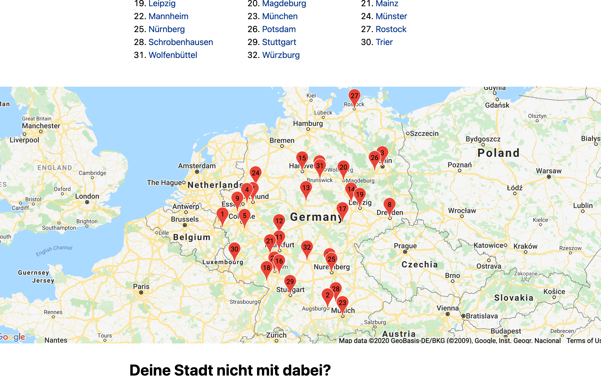
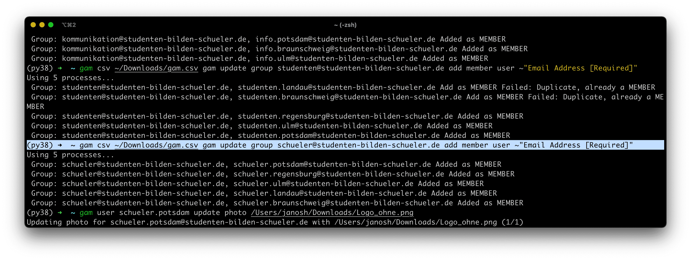

# Guide to Google Apps Manager

## Rationale

As our chapter count grows, do does the size of our [Google Workspace](https://workspace.google.com). As the number of accounts has reached 200, it's becoming increasingly important to be able perform bulk operations for managing group memberships, profile information, email signatures, etc.

[](https://studenten-bilden-schueler.de/standorte)

Google Apps Manager (GAM) is a powerful command line utility with comprehensive batch operations for all manner of Google Workspace functionality. It's available at <https://github.com/jay0lee/gam>. Install it by opening a terminal and running

```sh
bash <(curl -s -S -L https://git.io/install-gam)
```

`gam` will guide you through the authentication and authorization process.

## Usage Examples

### Add accounts to group

To add multiple (usually newly created) accounts to a group, use a CSV file containing all (and only) the emails to be added to the group in one column:

```sh
gam csv path/to/file.csv gam update group kommunikation add member user ~"Email Address [Required]"
```



Or, directly on the command line without CSV:

```sh
gam update group kommunikation add member info.weimar info.hamburg info.bayreuth info.greifswald
gam update group schueler add member schueler.weimar schueler.hamburg schueler.bayreuth schueler.greifswald
gam update group studenten add member studenten.weimar studenten.hamburg studenten.bayreuth studenten.greifswald
```

### Set profile pictures

```sh
gam group (schueler|studenten|kommunikation) update photo path/to/image.png
```


## Helpful Links

- [GAM docs](https://github.com/jay0lee/GAM/wiki): very detailed and comprehensive
- [GAM commands](https://sites.google.com/jis.edu.bn/gam-commands): extensive list of usage examples
- [Google Drive](https://drive.google.com/drive/folders/1FfvgltvxH_fb1ee7efXcXgAZxO4HcBP4): Link to a folder with CSV files for bulk adding new users (requires authentication)

## Create Accounts for new Chapter

```sh
gam create user info.oldenburg \
 firstname Kommunikation \
 lastname Oldenburg \
 password Abcdef1234 \
 changepassword on \
 org /Standorte \
 recoveryemail it@studenten-bilden-schueler.de

gam create user schueler.oldenburg \
 firstname Kommunikation \
 lastname Schüler \
 password Abcdef1234 \
 changepassword on \
 org /Standorte \
 recoveryemail it@studenten-bilden-schueler.de

gam create user studenten.oldenburg \
 firstname Kommunikation \
 lastname Studenten \
 password Abcdef1234 \
 changepassword on \
 org /Standorte \
 recoveryemail it@studenten-bilden-schueler.de

for division in schueler info studenten
do
  gam user $division.oldenburg update photo gmail/images/sbs-owls.png
  gam update group $division add member $division.oldenburg
done
```
